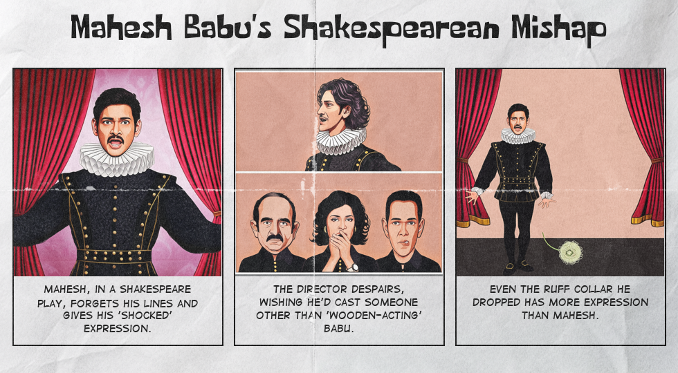
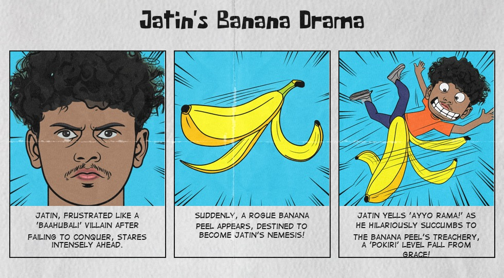

# Customized Comic Strip Generator

Follow these steps to set up the project locally using **Conda**:

##  Clone the Repository

```bash
git clone https://github.com/Chandrahas455/Customized-Comic-Strip-Generator.git
cd Customized-Comic-Strip-Generator
```

##  Create Environment

```bash
conda create --name comicgen python=3.10 -y
conda activate comicgen
```

##  Install Dependencies

```bash
pip install -r requirements.txt
```

##  Add your Gemini API Key in .env

```bash
GEMINI_API_KEY = "PASTE YOUR GEMINI KEY HERE"
```

## CLI Usage

You can  generate the comic strip using the **CLI**  by running the project through a Python script. Here's how to do it:

```bash
python main_cli.py --input path_to_your_image --name "Your Name" --guide "Optional storyline prompt"
```

## Run the Gradio App

Run the Gradio App for easy usage :

```bash
python gradio_app.py
```
## Run the Docker

Build the docker image by following the steps below:

### Set Gemini Key in .env
```bash
GEMINI_API_KEY = "PASTE YOUR GEMINI KEY HERE"
```
### Build your Docker Image

```bash
docker build -t comicstripgenerator:v1 .
```

### Run the Docker
```bash
docker run -it -p 7860:7860 comicstripgenerator:v1

```
# Example Results

Here are a few example results from the comic generator. These show how the input image and the storyline come together to create a **whacky comic strip**!

## Example 1: "Mahesh Babu's Shakespearean Mishap"

### Input:

- **Image**: A photo of Mahesh
- **Name**: Mahesh
- **Storyline**: "Jokes about his acting skills"

### Output:



---

## Example 2: "Jatin's Banana Drama"

### Input:

- **Image**: A photo of Jatin
- **Name**: Jatin
- **Storyline**: Blank

### Output:



---

> 💡 **Tip**: These are just a few examples! You can customize your own comic with any photo and storyline to create something unique.

---


